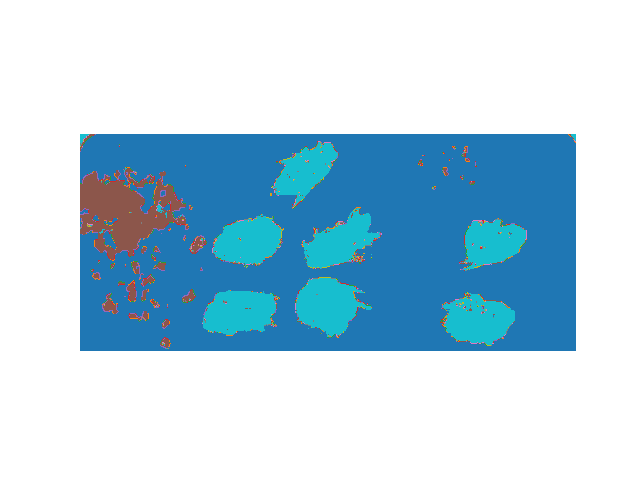

# bees-hyperspectrum

This is my attempt on classification on hyperspectral images. This is not much of a serious project but rather a journey through new experiences

In this notebook I covered steps I made towards classifying each pixel into 3 categories - mites, bees and background. Image was taken by a hyperspectral camera. Feel free to check out [details](https://www.kaggle.com/datasets/imonbilk/bee-dataset-but-hs).

# Results

In my opinion this is far from the best achievable results. There could be improvements made by:
 - picking another algorithm
 - training a deep neural network (Fast-Forward Neural Network, 2D-CNN, 3D-CNN, ...)
 - image preprocessing (gaussian filter, normalising background)
 - image post-processing (morphology could clear out some "holes" in objects)
